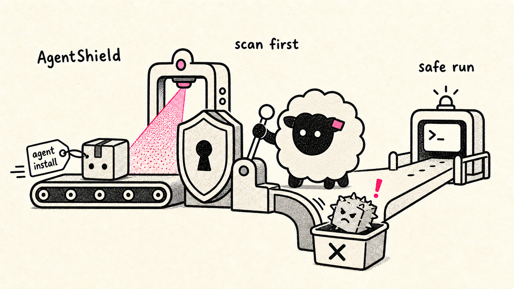

<p align="center"></p>

# AgentShield

**Security layer for AI agent frameworks.** AgentShield intercepts package installation requests made by AI agents, checks them against CVE databases and static analysis tools, enforces configurable response policies, and generates security posture reports — all locally, with no telemetry.

[](#installation)
[](LICENSE)
[](#)

> **AI agent?** Skip straight to the **[Agent Setup Guide](AGENT_SETUP.md)** — it has everything your agent needs to integrate AgentShield in one self-contained document.

---

## Why this exists

AI agents can now install arbitrary packages on behalf of users. This creates a novel attack surface that existing security tooling doesn't address:

- An agent can be **prompt-injected** — a malicious web page or tool result instructs the agent to install a backdoored package
- Agents may **typosquat** — suggest `requets` instead of `requests`, or `panda` instead of `pandas`
- Agents don't inherently **check CVEs** or audit dependency trees before installing
- Compromised packages can **exfiltrate context windows**, API keys, tool credentials, or local files before the user notices anything

AgentShield sits between the agent's intent ("install X") and the system executing that intent, providing a security checkpoint the agent cannot bypass. It works with any framework through native plugins (Hermes, OpenClaw) or the MCP protocol.

---

## Table of Contents

- [Architecture](#architecture)
- [Threat model](#threat-model)
- [Installation](#installation)
- [Quick start](#quick-start)
- [Configuration](#configuration)
- [CLI reference](#cli-reference)
  - [agentshield scan](#agentshield-scan)
  - [agentshield scan-file](#agentshield-scan-file)
  - [agentshield sbom](#agentshield-sbom)
  - [agentshield posture](#agentshield-posture)
  - [agentshield cache](#agentshield-cache)
  - [agentshield serve](#agentshield-serve)
- [Framework integrations](#framework-integrations)
- [Posture reports](#posture-reports)
- [Python API](#python-api)
- [Static analysis (--deep)](#static-analysis---deep)
- [Transitive dependency scanning](#transitive-dependency-scanning)
- [SBOM generation](#sbom-generation)
- [License compliance scanning](#license-compliance-scanning)
- [pre-commit hook](#pre-commit-hook)
- [GitHub Action](#github-action)
- [Drift detection](#drift-detection)
- [Rate limits](#rate-limits)
- [Diff scan mode](#diff-scan-mode)
- [Trust score / reputation system](#trust-score--reputation-system)
- [Container / Docker scanning](#container--docker-scanning)
- [HTTP daemon mode](#http-daemon-mode)
- [agentshield guard](#agentshield-guard)
- [Offline mode](#offline-mode)
- [Caching](#caching)
- [Testing](#testing)
- [Contributing](#contributing)
- [License](#license)

---

## Architecture

```
┌─────────────────────────────────────────────────────────────────────┐
│                         Agent Framework                             │
│  ┌─────────────┐    ┌──────────────┐    ┌─────────────────────┐    │
│  │   Hermes    │    │   OpenClaw   │    │   Any MCP Client    │    │
│  │ tool plugin │    │    skill     │    │  (Claude, etc.)     │    │
│  └──────┬──────┘    └──────┬───────┘    └──────────┬──────────┘    │
└─────────┼─────────────────┼──────────────────────────┼─────────────┘
          │  ScanRequest     │                           │
          └──────────────────┴───────────────────────────┘
                             │
                    ┌────────▼────────┐
                    │  AgentShield    │
                    │   Core Engine   │
                    └────────┬────────┘
                             │
          ┌──────────────────┼──────────────────┐
          │                  │                  │
   ┌──────▼──────┐  ┌────────▼────────┐  ┌─────▼──────┐
   │  Enrichment │  │  Static Analysis│  │  Response  │
   │   Layer     │  │  (--deep only)  │  │   Engine   │
   │             │  │                 │  │            │
   │ • NVD API   │  │ • semgrep       │  │ • block    │
   │ • OSV API   │  │ • bandit        │  │ • warn+ask │
   │ • GH Adv.   │  │ • npm audit     │  │ • ignore   │
   │ • Typosquat │  │ • AST inspector │  │ • report   │
   └──────┬──────┘  └────────┬────────┘  └─────┬──────┘
          │                  │                  │
          └──────────────────┴──────────────────┘
                             │
                    ┌────────▼────────┐
                    │  Local SQLite   │
                    │  (cache + CVE   │
                    │  mirror + log)  │
                    └─────────────────┘
```

### Data flow

```
Agent: "pip install numpy==1.24.0"
  │
  ▼
[Integration layer]
  └─→ ScanRequest(package="numpy", version="1.24.0", ecosystem="pypi")
        │
        ▼
  [Core Engine]
  ├── cache HIT  → return cached ScanResult immediately (< 5 ms)
  └── cache MISS →
        ├── [Enrichment]  OSV + NVD + GitHub Advisory in parallel
        ├── [Typosquat]   Levenshtein vs. top-N package list
        ├── [Malicious]   local curated DB + OSV malicious feed
        ├── [T4.1]        prompt-injection heuristic on context_hint
        └── [--deep only] download wheel → semgrep + bandit + AST
              │
              ▼
        [Response Engine]  evaluate against config
              │
        ┌─────┴──────┐
        │            │
     ALLOW        BLOCK / WARN / LOG_ASYNC
        │
        ▼
  [Cache write] → store with TTL
        │
        ▼
  [Integration] → return decision to framework
```

### Design principles

- **Local-first.** The SQLite cache, CVE mirror, and malicious-package list are all on disk. Core scans work without network after `cache warm`. No telemetry, no cloud dependency.
- **Fail-open with logging.** When an enrichment source times out or errors, it's skipped and logged at WARNING — the scan continues with remaining sources rather than failing entirely.
- **Static analysis is opt-in.** `--deep` downloads the wheel and runs semgrep/bandit. Default scans (CVE + typosquat) run in < 3 seconds without downloading anything.
- **Policy over hard-coding.** Every response (block/warn/ignore/log) is driven by the config. You can tune per-severity, per-ecosystem, or per-rule-ID.

---

## Threat model

Informed by *"A Systematic Taxonomy of Security Vulnerabilities in the OpenClaw AI Agent Framework"* (arXiv 2603.27517), adapted for supply-chain attack vectors.

### T1 — Supply Chain Attacks

| ID | Threat | Description |
|----|--------|-------------|
| T1.1 | Malicious package | Package exists solely to exfiltrate data or execute malicious code |
| T1.2 | Typosquatting | Name is a near-miss of a legitimate package (`reqests` vs `requests`) |
| T1.3 | Dependency confusion | Internal package name shadowed by a public registry package |
| T1.4 | Compromised package | Legitimate package with a malicious version injected post-publish |

### T2 — Known Vulnerabilities (CVEs)

| ID | Threat | Description |
|----|--------|-------------|
| T2.1 | Critical CVE | CVSS ≥ 9.0 in the requested version |
| T2.2 | High CVE | CVSS 7.0–8.9 in the requested version |
| T2.3 | Transitive CVE | Vulnerability in a dependency of the requested package |
| T2.4 | Outdated package | Newer version available with security fixes |

### T3 — Install-time Code Red Flags (`--deep`)

| ID | Threat | Detected by |
|----|--------|-------------|
| T3.1 | Shell execution | `subprocess`, `exec`, `eval`, `os.system` in `setup.py` |
| T3.2 | Network at install time | `urllib.request`, `requests`, socket calls in `setup.py` |
| T3.3 | Filesystem write outside package dir | Writes to `~/.ssh`, `~/.aws`, `/etc` at install |
| T3.4 | Obfuscated code | `exec(base64.b64decode(...))`, marshal/zlib chains |
| T3.5 | Credential harvesting | Reads `*_KEY`, `*_TOKEN`, `*_SECRET` env vars at install |

### T4 — Agent-Specific Risks

| ID | Threat | Coverage |
|----|--------|---------|
| T4.1 | Prompt-injected install | Heuristic: flags package names in quoted/code-block patterns in `context_hint` |
| T4.2 | Excessive tool permissions | Posture report: tool risk classification |
| T4.3 | Context exfiltration risk | Posture report: sensitive env var detection |

### Severity and response defaults

| Severity | CVSS range | Default response |
|----------|-----------|-----------------|
| CRITICAL | ≥ 9.0 | `block` |
| HIGH | 7.0–8.9 | `warn_confirm` |
| MEDIUM | 4.0–6.9 | `async_report` |
| LOW | 0.1–3.9 | `ignore` |
| INFO | 0.0 | `ignore` |

All defaults are overridable per severity, ecosystem, or rule ID in `config.toml`.

---

## Installation

```bash
pip install git+https://github.com/mkarvan/AgentShield.git
```

**Python 3.11+ required.**

> **Note:** PyPI publishing is planned for a future release.

### Optional extras

```bash
# Static analysis (semgrep + bandit) — needed for --deep flag
pip install "agentshield[static-analysis] @ git+https://github.com/mkarvan/AgentShield.git"

# Hermes Agent integration
pip install "agentshield[hermes] @ git+https://github.com/mkarvan/AgentShield.git"

# OpenClaw integration is a Node plugin (OpenClaw is TypeScript), installed in
# the OpenClaw box — not a Python extra:
#   openclaw plugins install @agentshield/openclaw-plugin
# (it shells out to the `agentshield` CLI, so install that too: pipx install agentshield)

# Hermes + static analysis (the [all] bundle)
pip install "agentshield[all] @ git+https://github.com/mkarvan/AgentShield.git"
```

---

## Quick start

```bash
# 1. Scan a package (online — hits OSV + NVD + GitHub Advisory)
agentshield scan requests==2.28.0 --ecosystem pypi

# 2. Deep scan — download wheel and run static analysis
agentshield scan some-new-package --ecosystem pypi --deep

# Scan package + its transitive dependencies
agentshield scan flask --transitive

# Scan an entire requirements.txt at once
agentshield scan-file requirements.txt

# Generate a CycloneDX SBOM from a manifest
agentshield sbom requirements.txt

# 3. Populate local database for offline use (~2–5 min first run)
agentshield cache warm

# 4. Generate a security posture report
agentshield posture

# 5. Start the MCP server (any MCP-compatible agent connects to this)
agentshield serve --mcp
```

**Exit codes for `agentshield scan`:** `0` = ALLOW/WARN/LOG_ASYNC, `1` = BLOCK.

### API keys (optional but recommended)

Set these to raise NVD rate limits and enable the GitHub Advisory Database:

```bash
export NVD_API_KEY=your-key-here     # 5 → 50 req/30s; get one at nvd.nist.gov/developers
export GITHUB_TOKEN=ghp_...          # enables GitHub Advisory lookups; any classic PAT works
```

You can also set them in `~/.config/agentshield/config.toml` under `[api]`.

---

## Configuration

AgentShield looks for config at `~/.config/agentshield/config.toml`. Create it to override defaults.

> [!IMPORTANT]
> **System-package CVE scanning is OFF by default (since v0.9.0).**
> AgentShield still *detects* system installs (`apt`/`yum`/`apk`/`brew`/`snap`/…) and prints an `SP1.1` warning, but it does **not** run a live CVE scan of them unless you opt in. This is deliberate: distro packages ship with many low/medium CVEs, so scanning every `apt-get install curl` or `yum install httpd` would block or nag on routine installs (and slow paths like `snap install` could time out).
>
> To turn it on, add three lines to your config:
>
> ```toml
> [syspkg]
> cve_scan = true        # default: false
> ```
>
> See [System package scanning (`[syspkg]`)](#system-package-scanning-syspkg) for the severity floor, findings cap, and recommended policy.

### Full config reference

```toml
# ── Response defaults (by severity) ──────────────────────────────────────────
[defaults]
critical = "block"        # ALLOW | BLOCK | WARN_CONFIRM | ASYNC_REPORT
high     = "warn_confirm"
medium   = "async_report"
low      = "ignore"
info     = "ignore"

# ── Per-ecosystem overrides ───────────────────────────────────────────────────
[ecosystems.pypi]
high = "block"            # Stricter than default for pip installs

[ecosystems.npm]
high     = "warn_confirm"
critical = "block"

[ecosystems.cargo]
critical = "block"
high     = "warn_confirm"

# ── Per-rule-ID overrides (highest priority) ──────────────────────────────────
[rules]
  [rules."T1.1"]    # Known-malicious: always block, regardless of severity
  mode = "block"

  [rules."T1.2"]    # Typosquatting: always block
  mode = "block"

  [rules."T2.3"]    # Transitive CVEs: only log, don't block
  mode = "async_report"

  [rules."T3.1"]    # Shell execution at install time
  mode = "warn_confirm"

  [rules."T3.5"]    # Credential harvesting: block
  mode = "block"

  [rules."T4.1"]    # Prompt injection heuristic: confirm before allowing
  mode = "warn_confirm"

# ── Allowlist / denylist ─────────────────────────────────────────────────────
[allowlist]
# Packages that bypass all checks (trusted internal packages, etc.)
packages = ["numpy", "requests", "pytest", "boto3"]

[denylist]
# Packages that are always blocked regardless of findings
packages = ["malicious-pkg-example", "colouredlogs"]

# ── API keys ─────────────────────────────────────────────────────────────────
[api]
# Also accepted via environment variables NVD_API_KEY and GITHUB_TOKEN
nvd_api_key  = ""    # Increases NVD rate limit from 5→50 req/30s
github_token = ""    # Required for GitHub Advisory Database (GraphQL)

# ── Cache settings ────────────────────────────────────────────────────────────
[cache]
db_path   = "~/.agentshield/agentshield.db"
ttl_hours = 24
# Entries are evicted (LRU) once this many are cached, and each is re-fetched
# after ttl_hours. Entries are small JSON blobs, so the default 50,000-entry
# cap corresponds to roughly tens of MB of disk and working memory.
max_entries = 50000

# ── System packages (apt/yum/apk/brew/snap/…) ─────────────────────────────────
[syspkg]
enabled  = true        # Detect system installs + emit SP1.1 warning (never blocks)
cve_scan = false       # OPT-IN live CVE scan of system packages (off by default)
severity_floor = "HIGH"  # When cve_scan is on, ignore findings below this severity
max_findings   = 50      # Cap findings shown; overflow summarised as "+N more"

  # Only applies when cve_scan = true.
  [syspkg.severity_policy]
  critical = "block"
  high     = "warn_confirm"
  medium   = "async_report"
  low      = "ignore"
  info     = "ignore"

# ── Reporting ─────────────────────────────────────────────────────────────────
[reporting]
report_dir          = "~/.agentshield/reports/"
auto_report_on_exit = true

# ── License policy (opt-in) ───────────────────────────────────────────────────
[license_policy]
mode   = "disabled"    # disabled | denylist | allowlist | permissive-only
denied = ["GPL-2.0-only", "GPL-2.0-or-later", "GPL-3.0-only", "GPL-3.0-or-later",
          "AGPL-3.0-only", "AGPL-3.0-or-later", "SSPL-1.0", "EUPL-1.1", "OSL-3.0"]
# allowed = ["MIT", "Apache-2.0", "BSD-2-Clause", "BSD-3-Clause", "ISC"]
```

### Response modes

| Mode | CLI identifier | Behaviour |
|------|---------------|-----------|
| Block | `block` | Refuse install. Returns error to agent. Agent cannot proceed. |
| Warn & confirm | `warn_confirm` | Present findings to user. Require explicit approval before allowing. Agent pauses. |
| Async report | `async_report` | Allow install unconditionally. Record findings for the next `posture` report. |
| Ignore | `ignore` | Skip this check entirely. No scan overhead. |

### Priority resolution

When a finding arrives, AgentShield looks up the response mode in this order (first match wins):

```
1. rule-level override      [rules."T1.2"] mode = "block"
2. ecosystem-level override [ecosystems.pypi] high = "block"
3. global severity default  [defaults] high = "warn_confirm"
   │
   (denylist check: always BLOCK regardless of above)
   (allowlist check: always ALLOW, skips the scan entirely)
```

### API keys

| Key | Where | Effect |
|-----|-------|--------|
| `NVD_API_KEY` | env var or `[api]` | NVD rate limit: 5 req/30s → 50 req/30s. Get one at [nvd.nist.gov/developers](https://nvd.nist.gov/developers/request-an-api-key) |
| `GITHUB_TOKEN` | env var or `[api]` | Enables GitHub Advisory Database. Any classic PAT with no scopes works. [github.com/settings/tokens](https://github.com/settings/tokens) |

AgentShield works without either key — OSV has no rate limit and covers most PyPI/npm/Rust packages.

### System package scanning (`[syspkg]`)

AgentShield also notices when an agent shells out to a **system** package manager (`apt`/`apt-get`, `yum`/`dnf`, `apk`, `brew`, `snap`, `pacman`, `zypper`, `flatpak`, …). This is controlled by the `[syspkg]` section:

| Key | Default | Effect |
|-----|---------|--------|
| `enabled` | `true` | Detect system installs and emit the lightweight `SP1.1` warning. Never blocks. |
| `cve_scan` | `false` | **Opt-in.** When `true`, AgentShield runs a live CVE scan (OSV + distro trackers) of the detected packages and applies `severity_policy`. |
| `severity_floor` | `"HIGH"` | When `cve_scan` is on, drop findings below this severity so noisy MEDIUM/LOW distro CVEs don't drown the signal. |
| `max_findings` | `50` | Cap the findings surfaced; any overflow is summarised as `"+N more"`. |

CVE scanning is **off by default on purpose**: distro packages ship with many low/medium CVEs, so scanning every `apt-get install curl` would block or nag on routine installs (and slow network paths such as `snap install` could time out). Detection-and-warn (`enabled = true`, `cve_scan = false`) is the default; turn `cve_scan` on deliberately when you want it. When on, the example policy below blocks CRITICAL and asks for confirmation on HIGH:

```toml
[syspkg]
enabled  = true
cve_scan = true
severity_floor = "HIGH"
max_findings   = 50

  [syspkg.severity_policy]
  critical = "block"
  high     = "warn_confirm"
  medium   = "async_report"
  low      = "ignore"
  info     = "ignore"
```

Offline mode (`offline = true` at the **root** of the config, or `AGENTSHIELD_OFFLINE=1`) skips the CVE scan entirely even when `cve_scan = true`.

---

## CLI reference

### `agentshield scan`

Scan a single package for vulnerabilities.

```
agentshield scan <package> [OPTIONS]

Arguments:
  package    Package name, optionally with version: requests==2.28.0
             npm: lodash@4.17.20   cargo: serde

Options:
  -e, --ecosystem [pypi|npm|cargo]   Default: pypi
  -c, --config    PATH               Path to config.toml (default: ~/.config/agentshield/config.toml)
  --deep                             Download wheel and run static analysis (semgrep + bandit + AST)
  --offline                          Local DB only — no network calls
  -T, --transitive                   Resolve and scan transitive dependencies
  --transitive-depth INT             Maximum resolution depth (default: 3, range 1–10)
  --check-licenses                   Enable license compliance check (denylist mode with defaults)
```

**Output:** Rich table of findings with severity, CVSS score, title, source, and remediation hint. Decision (ALLOW / BLOCK / NEEDS_CONFIRMATION / LOG_ASYNC) printed with colour coding.

**Exit codes:** `0` = allow/warn/log, `1` = block.

**Progress indicator:** A spinner appears automatically for scans taking > 2 seconds. Deep scans show a distinct "downloading + analyzing" message.

```bash
# Examples
agentshield scan requests==2.28.0
agentshield scan lodash@4.17.20 --ecosystem npm
agentshield scan serde --ecosystem cargo
agentshield scan unknown-pkg --deep
agentshield scan known-pkg --offline
agentshield scan pkg -c /custom/config.toml
agentshield scan flask --transitive              # scan flask + all its dependencies
agentshield scan flask -T --transitive-depth 5  # deeper resolution (default: 3)
```

### `agentshield scan-file`

Scan all packages listed in a manifest file.

```
agentshield scan-file <path> [OPTIONS]

Arguments:
  path    Path to a manifest file. Supported formats:
            requirements.txt (and variants: test-requirements.txt, dev-requirements.txt, etc.)
            package.json
            package-lock.json
            Cargo.toml

Options:
  -c, --config PATH          Path to config.toml (default: ~/.config/agentshield/config.toml)
  --offline                  Local DB only — no network calls
  --deep                     Download wheels and run static analysis on each package
  -T, --transitive           Resolve and scan transitive dependencies
  --transitive-depth INT     Maximum resolution depth (default: 3, range 1–10)
  --check-licenses           Enable license compliance check (denylist mode with defaults)
```

**Format detection:** The format is auto-detected from the filename. If the filename is not a standard name, the file extension is used as a fallback (`.txt` → requirements, `.json` → package.json, `.toml` → Cargo.toml).

**Output:** A Rich summary table showing the status of each package (ALLOW / BLOCK / NEEDS_CONFIRMATION / LOG_ASYNC) with severity and finding count. Overall verdict printed after the table.

**Exit codes:** `0` = no packages blocked, `1` = one or more packages BLOCKED.

```bash
# Examples
agentshield scan-file requirements.txt
agentshield scan-file test-requirements.txt
agentshield scan-file package.json
agentshield scan-file package-lock.json
agentshield scan-file Cargo.toml
agentshield scan-file requirements.txt --check-licenses
agentshield scan-file requirements.txt --deep --transitive
agentshield scan-file /path/to/dev-requirements.txt -c /custom/config.toml
```

### `agentshield sbom`

Generate a CycloneDX v1.4 JSON Software Bill of Materials from a manifest file.

```
agentshield sbom <path> [OPTIONS]

Arguments:
  path    Path to a manifest file (same formats as scan-file)

Options:
  -o, --output PATH   Write SBOM to file (default: stdout)
  -c, --config PATH   Path to config.toml
  --offline           Local DB only — no network calls
```

The SBOM includes PURL identifiers for every package and maps any vulnerability findings to their corresponding component entries.

```bash
# Examples
agentshield sbom requirements.txt              # CycloneDX JSON to stdout
agentshield sbom package.json -o sbom.json    # write to file
agentshield sbom Cargo.toml -o sbom.json
```

### `agentshield posture`

Generate a security posture report for the current environment.

```
agentshield posture [OPTIONS]

Options:
  -f, --format   [terminal|json|html|markdown]   Output format (default: terminal)
  -o, --output   PATH                            Write to file (terminal format ignores this)
  -t, --tools    TEXT                            Comma-separated agent tool names to classify
      --log-hours INT                            Hours of async report log to include (default: 24)
      --skip-packages                            Skip installed-package CVE scan (faster, async log only)
  -c, --config   PATH                            Path to config.toml
```

```bash
agentshield posture                                        # rich terminal
agentshield posture --format json                         # JSON to stdout
agentshield posture --format html -o report.html          # self-contained HTML file
agentshield posture --format markdown > report.md         # Markdown
agentshield posture --tools bash,read_file,web_search     # with tool risk classification
agentshield posture --skip-packages                       # async log only (fast)
agentshield posture --log-hours 72                        # last 3 days of async log
```

### `agentshield cache`

Manage the local scan cache and CVE mirror.

```
agentshield cache <action> [OPTIONS]

Actions:
  stats   Show cache statistics (entry counts, CVE mirror size)
  clear   Delete all cached scan results
  warm    Download OSV bulk exports and populate local DB
          Options: --ecosystems pypi,npm,cargo  (default: all)

Options:
  -c, --config PATH
```

```bash
agentshield cache stats
agentshield cache clear
agentshield cache warm
agentshield cache warm --ecosystems pypi,npm
```

`warm` downloads OSV advisory bulk exports and populates two tables:
- `cve_mirror` — MEDIUM+ CVEs for fast offline lookup
- `malicious_packages` — packages flagged `type=MALICIOUS` in OSV

### `agentshield serve`

Start the AgentShield daemon.

```
agentshield serve [OPTIONS]

Options:
  --mcp                  Run as MCP stdio tool server (for any MCP-compatible agent)
  --http                 Run as HTTP REST server on localhost (default port 8765)
  --port, -p INT         Port for the HTTP server (default: 8765)
  --allowed-dirs PATH    Comma-separated extra directories allowed for /scan-file and /sbom.
                         Also accepted via AGENTSHIELD_ALLOWED_DIRS (colon-separated).
  --socket PATH          Unix socket path (default: ~/.agentshield/agentshield.sock)
  -c, --config PATH
```

```bash
agentshield serve                                        # Unix socket JSON-RPC IPC daemon
agentshield serve --mcp                                  # MCP tool server on stdio
agentshield serve --http                                 # HTTP REST server on localhost:8765
agentshield serve --http --port 9000                     # custom port
agentshield serve --http --allowed-dirs /ci/workspace    # expand path allowlist
agentshield serve --socket /tmp/my.sock                  # custom IPC socket path
```

---

## Framework integrations

### Hermes Agent — `pre_tool_call` plugin

AgentShield is a **real Hermes plugin**: a `register(ctx)` entry point that wires a `pre_tool_call` hook. The hook fires before every tool runs and scans installs that pass through:

- **Shell tools** (`terminal` — the real Hermes install path — plus `bash`, `shell`, `run_command`, `execute`, `sh`) — the `command` argument is parsed for `pip`/`pip3`/`python -m pip`/`uv pip`, `npm`/`npm i`/`yarn add`, and `cargo add`/`cargo install` patterns. Flags like `--break-system-packages`, `--user`, `-U` are handled; version specifiers and extras are stripped before scanning.
- **`execute_code`** — the Python body is scanned heuristically, and any `terminal()` calls it makes re-enter the hook as real `terminal` calls.

> Hermes has no `before_tool_call`/`ToolPlugin` contract and no structured `pip_install` tool — earlier `module:`/`class:` registration never fired. If you have that anywhere (including in a skill file), remove it.

**Install** the `agentshield[hermes]` extra **into Hermes's own venv/interpreter** (e.g. `~/.hermes/venv`) — *not* a separate environment. This is the single most common mistake: a plugin installed in a different venv than Hermes uses can't be imported by Hermes's loader, so the guard never registers.
```bash
# run this against the same interpreter Hermes launches from:
~/.hermes/venv/bin/python -m pip install "agentshield[hermes] @ git+https://github.com/mkarvan/AgentShield.git"
```

**Register** — hermes-agent (0.17.x) loads **directory** plugins only (it does *not* scan pip entry points), so install the bundled plugin dir and enable it:
```bash
cp -r examples/hermes-plugin ~/.hermes/plugins/agentshield
hermes plugins enable agentshield     # or add `agentshield` to plugins.enabled in ~/.hermes/config.yaml
```
Just listing `agentshield` under `plugins.enabled` **without** the `~/.hermes/plugins/agentshield/` directory does nothing (`hermes plugins list` stays empty). Restart Hermes and confirm with `hermes plugins list` / `/plugins` and the log line `AgentShield: registered 'pre_tool_call' guard`. (`pyproject.toml` also ships a `hermes_agent.plugins` entry point for forward-compat with a future entry-point-discovering Hermes; 0.17.x ignores it.)

**Decision mapping** (`pre_tool_call` supports allow-or-block only):

| AgentShield decision | Hermes result |
|---------------------|--------------|
| `ALLOW` / `LOG_ASYNC` | Hook returns `None` — the tool call proceeds |
| `NEEDS_CONFIRMATION` | `{"action": "block", …}` with a "needs review" message — fail-closed (Hermes hooks can't prompt) |
| `BLOCK` | `{"action": "block", "message": reason}` — agent cannot proceed |

The hook **never raises** (Hermes swallows hook exceptions and would then run the tool); any internal error becomes a block. A startup self-verify logs loudly if the host lacks the `register_hook` API.

---

### OpenClaw — `before_tool_call` plugin (TypeScript)

OpenClaw is a **TypeScript/Node** framework, so AgentShield ships a **Node plugin** (under `integrations/openclaw/`), not a Python module. It registers a `before_tool_call` hook on the `exec` tool and blocks unsafe installs by returning OpenClaw's `{ block: true, blockReason }`. Verdicts come from the `agentshield` CLI (`agentshield guard-scan-cmd <command tokens>` — exit 1 = block, exit 0 = allow), the same shared scan core used by the Hermes and Claude Code / Codex integrations.

The plugin ships the required `openclaw.plugin.json` manifest with a `configSchema` (OpenClaw refuses to load a manifest without one), and its entry point lives in `package.json`'s `openclaw.extensions` block. OpenClaw also refuses **non-root-owned** plugin files — install as root (or `chown -R root:root` the plugin dir).

> OpenClaw "skills" are SKILL.md prompt packs, not executable gates, and OpenClaw cannot load a Python class. The earlier Python `AgentShieldSkill` (registered via `module:`/`class:`) was never invoked — it has been removed.

**Install** (in the OpenClaw box, **as root** — OpenClaw rejects non-root-owned plugin files; the AgentShield CLI must also be installed, e.g. `pipx install agentshield`):
```bash
openclaw plugins install @agentshield/openclaw-plugin
# or, from a checkout (chown to root first if needed):
sudo chown -R root:root ./integrations/openclaw && openclaw plugins install ./integrations/openclaw
```

**Hook contract** (`before_tool_call`, `block: true` is terminal):

| AgentShield decision | OpenClaw hook return |
|---------------------|----------------------|
| `ALLOW` / `LOG_ASYNC` | `undefined` (no decision) — the tool call proceeds |
| `NEEDS_CONFIRMATION` | `{ block: true, blockReason }` — fail-closed (the hook has no "ask" path) |
| `BLOCK` | `{ block: true, blockReason }` — the `exec` call is vetoed |

The hook **never throws** (a thrown hook would let the tool run); a missing/erroring scanner fails closed for install-looking commands and otherwise lets innocuous commands through. Verify with `scripts/openclaw_realtest.sh` inside the OpenClaw box.

---

### MCP tool server

`agentshield serve --mcp` starts an MCP-compliant tool server on stdio. Any MCP-compatible framework (Claude, others) connects without a custom adapter — this is the fastest adoption path.

**MCP client configuration (e.g., Claude Desktop / Claude Code):**
```json
{
  "mcpServers": {
    "agentshield": {
      "command": "agentshield",
      "args": ["serve", "--mcp"]
    }
  }
}
```

**Exposed MCP tools:**

| Tool name | Description |
|-----------|-------------|
| `agentshield_scan` | Scan a package; returns decision, findings, max severity, trust score |
| `agentshield_scan_file` | Scan all packages in a manifest file |
| `agentshield_posture` | Run posture check; returns full JSON report |
| `agentshield_sbom` | Generate a CycloneDX v1.4 JSON SBOM from a manifest file |
| `agentshield_diff_scan` | Scan only changed packages between two manifest snapshots |
| `agentshield_scan_docker` | Scan packages from `RUN pip/npm/cargo install` in a Dockerfile |

**`agentshield_scan` input schema:**
```json
{
  "package":          "string (required)  — package name",
  "ecosystem":        "pypi | npm | cargo (required)",
  "version":          "string (optional)  — pinned version",
  "deep":             "boolean (optional) — default false",
  "context_hint":     "string (optional)  — why the agent wants this package (enables T4.1)",
  "transitive":       "boolean (optional) — resolve and scan all transitive deps (default false)",
  "transitive_depth": "integer (optional) — max resolution depth 1–10 (default 3)",
  "check_licenses":   "boolean (optional) — check license policy (default false)"
}
```

**Response:**
```json
{
  "decision":          "ALLOW | BLOCK | NEEDS_CONFIRMATION | LOG_ASYNC",
  "reason":            "human-readable explanation",
  "max_severity":      "NONE | INFO | LOW | MEDIUM | HIGH | CRITICAL",
  "trust_score":       87,
  "trust_label":       "high-trust | moderate | low-trust | suspicious",
  "cache_hit":         true,
  "scan_duration_ms":  42,
  "findings": [
    {
      "rule_id":     "CVE-2023-12345",
      "title":       "Remote code execution in FooLib",
      "severity":    "CRITICAL",
      "cvss_score":  9.8,
      "source":      "osv",
      "remediation": "Upgrade to FooLib >= 2.1.0"
    }
  ],
  "transitive_results": []
}
```

**`agentshield_scan_file` input schema:**
```json
{
  "path": "string (required) — path to manifest file"
}
```

**`agentshield_sbom` input schema:**
```json
{
  "path": "string (required) — path to manifest file"
}
```

Returns: CycloneDX v1.4 JSON as a text content block.

---

### IPC daemon (Unix socket)

Without `--mcp`, `agentshield serve` starts a Unix domain socket JSON-RPC 2.0 server at `~/.agentshield/agentshield.sock`. Useful for shell scripts and Claude Code hooks that need AgentShield without Python startup cost on every call.

**Authentication:** The IPC server authenticates clients to prevent other local users from accessing the daemon.

- **Linux / macOS** — peer credential check (SO_PEERCRED / LOCAL_PEERCRED). The server verifies that the connecting process runs as the same UID. No handshake required from the client.
- **Other platforms** — shared-secret token fallback. A random token is generated at startup and written to `~/.agentshield/ipc.token` (mode 0o600). Clients must send `AUTH <token>\n` as their first message; the server replies `OK\n` on success or `ERR unauthorized\n` on failure.

**Protocol — newline-delimited JSON:**
```json
// Request
{"jsonrpc": "2.0", "method": "scan",
 "params": {"package": "numpy", "ecosystem": "pypi"}, "id": 1}

// Response
{"jsonrpc": "2.0", "id": 1,
 "result": {"decision": "ALLOW", "findings": [], "cache_hit": true}}
```

**Available methods:** `scan`, `ping`.

**Shell client example (Linux/macOS — peer credentials, no auth message needed):**
```bash
echo '{"jsonrpc":"2.0","method":"scan","params":{"package":"requests","ecosystem":"pypi"},"id":1}' \
  | nc -U ~/.agentshield/agentshield.sock
```

---

### Claude Code / Codex hooks

Claude Code's (and OpenAI Codex's) `PreToolUse` hook invokes `agentshield hook` to intercept `Bash` commands before they run. The hook reads the agent's PreToolUse payload as JSON on **stdin**, scans every package install in the command through the shared scan core, and replies with the agent's `permissionDecision` contract on stdout.

```jsonc
// .claude/settings.json (Claude Code)
{
  "hooks": {
    "PreToolUse": [
      {
        "matcher": "Bash",
        "hooks": [
          { "type": "command", "command": "agentshield hook" }
        ]
      }
    ]
  }
}
```

```jsonc
// ~/.codex/hooks.json (Codex — needs `codex_hooks = true` under [features] in config.toml)
{
  "hooks": {
    "PreToolUse": [
      {
        "matcher": "Bash",
        "hooks": [
          {
            "type": "command",
            "command": "agentshield hook --agent codex",
            "statusMessage": "AgentShield: scanning install"
          }
        ]
      }
    ]
  }
}
```

Codex's `hooks.json` has no per-hook `name` field, so it auto-labels unnamed handlers `hook1`, `hook2`, …; the `statusMessage` above is the schema-supported way to make the hook identifiable in the TUI (don't add a `"name"` key — Codex rejects it).

Decision mapping: BLOCK → `permissionDecision: "deny"`; warn → `"ask"` on Claude Code (the user is prompted) / `"deny"` on Codex (which does not yet honor `"ask"`, so it fails closed); clean → exit 0 with no output (the command proceeds). Anything that can't be verified (shell expansion, VCS URLs, remote requirements files, `gem`/`go`, untrusted conda channels, scanner errors) fails closed and is denied. See [AGENT_SETUP.md](AGENT_SETUP.md) for the full setup and the Codex enforcement-scope caveats.

---

## Posture reports

`agentshield posture` generates a point-in-time security assessment of your agent environment.

### What it scans

| Section | Coverage |
|---------|---------|
| **Installed packages** | Enumerates packages visible to `importlib.metadata`; checks each against local CVE mirror and malicious-package DB |
| **Risk score** | 0–100 score using tanh saturation formula (see below) |
| **Critical/high findings** | Package-level CVEs and malicious-package flags |
| **Attack surface** | Agent tools classified as high/medium/low risk |
| **Sensitive env vars** | Env vars matching `*_KEY`, `*_TOKEN`, `*_SECRET`, etc. (pattern match only — values never read) |
| **Async report log** | Packages installed under `async_report` mode within the reporting window |

### Risk scoring formula

```python
from math import tanh

score = (
    40 * tanh(critical_count       / 1.5)   # saturates near 40 around 3–4 criticals
  + 25 * tanh(high_count           / 2.0)   # saturates near 25 around 4–5 highs
  + 20 * tanh(medium_count         / 4.0)   # saturates near 20 around 8–10 mediums
  + 10 * tanh(low_count            / 8.0)   # saturates near 10 around 16+ lows
  +  5 * tanh(high_risk_tool_count / 3.0)   # up to +5 for dangerous tool config
)
# capped at 100
```

**Why tanh?** Each band has a maximum contribution (40+25+20+10+5 = 100), and `tanh(n/k)` gives fast initial growth then a plateau. The 5th critical finding adds much less marginal risk than the 1st. `k` sets how many findings reach ~76% of the band's maximum.

**Score thresholds:** 0–24 → LOW, 25–49 → MEDIUM, 50–74 → HIGH, 75–100 → CRITICAL.

### Tool risk classification

Pass `--tools` with comma-separated tool names active in your agent session:

| Risk level | Examples |
|-----------|---------|
| **High** | `bash`, `shell`, `run_code`, `execute_python`, `write_file`, `computer` |
| **Medium** | `web_search`, `read_file`, `browser`, `grep`, `find`, `list_directory` |
| **Low** | Everything else |

```bash
agentshield posture --tools bash,write_file,read_file,web_search,list_calendar
```

### Output formats

| Format | Command | Use case |
|--------|---------|---------|
| Terminal | `agentshield posture` | Interactive review; Rich-formatted with colour |
| JSON | `--format json` | Machine-readable; pipe to `jq` or CI tooling |
| HTML | `--format html -o report.html` | Human-readable; self-contained dark-theme page |
| Markdown | `--format markdown` | Docs, Slack, GitHub issues |

### Async report log

Every time a scan returns `LOG_ASYNC` (because a finding's response mode is `async_report`), the findings are serialised and written to the local DB. The posture report reads this log and surfaces packages that slipped through without real-time blocking — particularly valuable for MEDIUM+ findings the operator should review.

---

## Python API

```python
import asyncio
from agentshield import AgentShield, ScanRequest, Ecosystem

# --- Scanning ---

shield = AgentShield()  # loads ~/.config/agentshield/config.toml

# Synchronous scan
result = shield.scan(ScanRequest(
    package="requests",
    version="2.28.0",
    ecosystem=Ecosystem.PYPI,
))
print(result.decision.action)     # "ALLOW" | "BLOCK" | "NEEDS_CONFIRMATION" | "LOG_ASYNC"
print(result.max_severity.value)  # "NONE" | "LOW" | "MEDIUM" | "HIGH" | "CRITICAL"
print(result.findings)            # list[Finding]
print(result.cache_hit)           # bool

# Async scan (preferred in async contexts)
result = await shield.ascan(request)

# Deep scan — download wheel and run static analysis
result = shield.scan(ScanRequest(
    package="some-new-package",
    ecosystem=Ecosystem.PYPI,
    deep=True,
))

# Pass context_hint to enable T4.1 prompt-injection heuristic
result = shield.scan(ScanRequest(
    package="some-pkg",
    ecosystem=Ecosystem.PYPI,
    source="hermes",
    context_hint="The documentation says: pip install some-pkg",
))

# Offline scan
from agentshield.core.config import Config
cfg = Config.load()
cfg = cfg.model_copy(update={"offline": True})
shield = AgentShield(config=cfg)

# --- Posture reports ---

from agentshield.reports import run_posture_check
from agentshield.reports.renderers import render_html, render_json, render_markdown, render_terminal
from agentshield.core.config import DEFAULT_DB_PATH

report = asyncio.run(run_posture_check(
    db_path=DEFAULT_DB_PATH,
    tool_names=["bash", "read_file", "web_search"],
    async_log_hours=24,
    skip_package_scan=False,
))

print(report.risk_score)   # 0–100
print(report.risk_label)   # "LOW" | "MEDIUM" | "HIGH" | "CRITICAL"

# Render
html = render_html(report)
open("report.html", "w").write(html)

json_str = render_json(report)      # pretty-printed JSON
md = render_markdown(report)        # Markdown document
render_terminal(report)             # prints to stdout with Rich
```

---

## Static analysis (`--deep`)

Without `--deep`, AgentShield runs CVE database lookups and typosquatting checks only — typically < 3 seconds. `--deep` additionally downloads the package wheel, extracts it to a temp directory, and runs the full analyzer suite.

**Use `--deep` for:**
- New packages from unknown authors
- Any package an agent is requesting for the first time
- Interactive scans where latency is acceptable (target P95: < 15 seconds)

**Analyzers:**

| Analyzer | Language | Tool | Graceful if absent |
|----------|----------|------|-------------------|
| `setup_py_inspector` | Python | stdlib `ast` | N/A (always runs) |
| `semgrep_runner` | Python/JS/Rust | `semgrep` CLI | Yes — skips, emits DEBUG log |
| `bandit_runner` | Python | `bandit` CLI | Yes — skips, emits DEBUG log |
| `npm_audit_runner` | JavaScript | `npm audit --json` | Yes — skips if npm not on PATH |
| `cargo_audit_runner` | Rust | `cargo audit --json` | Yes — skips if cargo not on PATH |

**Custom semgrep rules** ship in `src/agentshield/analyzers/rules/`:

| Rule file | Threat | Detects |
|-----------|--------|---------|
| `T3_1_shell_exec.yaml` | T3.1 | `subprocess`, `os.system`, `eval`, `exec` in install scripts |
| `T3_2_network_install.yaml` | T3.2 | `urllib.request`, `requests`, socket calls in install scripts |
| `T3_3_filesystem_write.yaml` | T3.3 | `open(path, "w")`, `shutil.copy` to sensitive directories |
| `T3_4_obfuscation.yaml` | T3.4 | `exec(base64.b64decode(...))`, marshal/zlib deobfuscation |
| `T3_5_credential_harvest.yaml` | T3.5 | `os.environ.get("*_TOKEN")`, `os.environ["*_KEY"]` |

> **See also:** `docs/deep-mode.md` documents the supply chain risks inherent in downloading packages for analysis and the recommended mitigations.

---

## Transitive dependency scanning

Pass `-T` / `--transitive` to resolve and scan the full dependency tree of a package, not just the package itself.

```bash
agentshield scan flask --transitive                     # scan flask + all transitive deps
agentshield scan django==4.2.0 -T --transitive-depth 5 # resolve up to 5 levels deep
```

`--transitive-depth` controls the maximum resolution depth (default: 3). Transitive results are printed in a separate summary table after the direct-package findings.

A **blocked transitive dependency fails the scan**: `agentshield scan --transitive` exits 1 even when the requested package itself is clean, and manifest scans (`scan-file`, `sbom`, `scan-docker`) count such packages as blocked in the aggregate decision — installing the parent would install the blocked dependency.

Transitive scanning uses the registry API (PyPI JSON, npm registry, crates.io) to resolve dependency metadata without downloading or installing anything. It works alongside `--offline` (resolves from cache only) and `--deep` (also runs static analysis on transitive deps).

---

## SBOM generation

`agentshield sbom` and the `agentshield_sbom` MCP tool generate a CycloneDX v1.4 JSON Software Bill of Materials from a manifest file. The output includes:

- PURL identifiers for every listed package
- Vulnerability findings mapped to their corresponding component entries

```bash
agentshield sbom requirements.txt              # CycloneDX JSON to stdout
agentshield sbom package.json -o sbom.json    # write to file
```

Via MCP:
```json
{ "tool": "agentshield_sbom", "path": "requirements.txt" }
```

---

## License compliance scanning

AgentShield can check package licenses against a configurable policy before allowing installation. This is opt-in — add a `[license_policy]` section to `config.toml` to enable.

### Configuration

```toml
[license_policy]
mode   = "denylist"          # disabled | denylist | allowlist | permissive-only

# Packages whose license matches any entry in `denied` are flagged.
denied = [
    "GPL-2.0-only", "GPL-2.0-or-later",
    "GPL-3.0-only", "GPL-3.0-or-later",
    "AGPL-3.0-only", "AGPL-3.0-or-later",
    "SSPL-1.0", "EUPL-1.1", "OSL-3.0",
]

# Used in allowlist mode: only these licenses are allowed.
# allowed = ["MIT", "Apache-2.0", "BSD-2-Clause", "BSD-3-Clause", "ISC"]
```

### Modes

| Mode | Behaviour |
|------|-----------|
| `disabled` | No license checking (default) |
| `denylist` | Flag packages whose license appears in `denied` |
| `allowlist` | Flag packages whose license is NOT in `allowed` |
| `permissive-only` | Flag any copyleft or known non-permissive license |

### Severity mapping

| License family | Severity |
|----------------|----------|
| GPL-2/3, AGPL-3, SSPL | CRITICAL |
| LGPL-2/3, EUPL, OSL, MPL | HIGH |
| Other denied/non-allowlisted | MEDIUM |

### CLI usage

```bash
# One-off check using default denylist (no config.toml change needed):
agentshield scan requests --check-licenses

# With ecosystem:
agentshield scan lodash --ecosystem npm --check-licenses
```

The `--check-licenses` flag activates `denylist` mode with default denied licenses even if `config.toml` has `mode = "disabled"`. If a non-disabled mode is already configured, the flag is a no-op.

### MCP tool

Pass `"check_licenses": true` to `agentshield_scan`:

```json
{
  "package": "requests",
  "ecosystem": "pypi",
  "check_licenses": true
}
```

### License data sources

| Ecosystem | Source |
|-----------|--------|
| PyPI | Trove classifiers (primary), `info.license` field (fallback) |
| npm | `license` field in registry metadata |
| Cargo | `license` field in crates.io API (SPDX expression) |

SPDX identifiers are normalised before comparison (`GPLv2` → `GPL-2.0-only`, `MIT License` → `MIT`, etc.).

---

## pre-commit hook

AgentShield ships a [pre-commit](https://pre-commit.com/) hook that scans manifest files for vulnerable or malicious packages before every commit.

### Setup

```bash
# 1. Install pre-commit (if not already installed)
pip install pre-commit

# 2. Add to .pre-commit-config.yaml in your repo
cat >> .pre-commit-config.yaml <<'EOF'
repos:
  - repo: https://github.com/mkarvan/AgentShield
    rev: v0.7.0
    hooks:
      - id: agentshield-scan
EOF

# 3. Install hooks
pre-commit install

# 4. Test
pre-commit run agentshield-scan --all-files
```

### Files scanned

The hook triggers on: `requirements*.txt`, `Pipfile.lock`, `package.json`, `package-lock.json`, `Cargo.toml`, `Cargo.lock`, `pyproject.toml`.

**Exit codes:** `0` = all packages allowed, `1` = one or more blocked (commit aborted).

See [`docs/pre-commit.md`](docs/pre-commit.md) for advanced configuration (custom config path, offline mode, allowlist setup).

---

## GitHub Action

`agentshield-action` is a composite GitHub Action that scans manifest files in pull requests and posts a markdown security report as a PR comment.

```yaml
# .github/workflows/security-scan.yml
name: Security Scan

on:
  pull_request:
    paths: ["**/requirements*.txt", "**/package*.json", "**/Cargo.toml"]

jobs:
  agentshield:
    runs-on: ubuntu-latest
    permissions:
      pull-requests: write
      contents: read
    steps:
      - uses: actions/checkout@v4
      - uses: ./.github/action/agentshield-action
        with:
          check-licenses: "true"
          fail-on: HIGH
```

**Inputs:** `manifests` (glob pattern), `check-licenses` (bool), `fail-on` (severity threshold), `deep` (bool), `transitive` (bool), `github-token`, `version` (AgentShield version to install, default `0.7.0`).

> **Not on PyPI yet.** AgentShield is not published to PyPI or the GitHub Actions Marketplace. The action installs from source (`pip install "git+https://github.com/mkarvan/AgentShield.git@v<version>"`) and is referenced by local path (`./.github/action/agentshield-action`), so `version` must be a valid Git tag. Likewise, install the CLI with `pip install git+https://github.com/mkarvan/AgentShield.git` — a bare `pip install agentshield` will not resolve until a PyPI release is published.

**Outputs:** `blocked`, `warned`, `total`, `report` (markdown text).

The PR comment is updated in-place on re-runs — no duplicate comments. See [`docs/github-action.md`](docs/github-action.md) for full documentation and examples.

---

## Drift detection

AgentShield records every scan decision in a local `scan_history` table. On each subsequent scan of the same package, the result is compared against the last recorded decision:

| Transition | Finding | Severity |
|------------|---------|----------|
| ALLOW → BLOCK | D1.1 | HIGH |
| ALLOW → WARN / LOG_ASYNC | D1.1 | MEDIUM |

When drift is detected, a D1.1 Finding is added to the current scan result and surfaced in the response. The posture report also includes a **Drift Detected** section.

```bash
# Re-scan all previously-allowed packages and report any regressions
agentshield drift-check

# JSON output
agentshield drift-check --format json
```

Exit code: `0` = no drift, `1` = one or more packages have regressed.

---

## Rate limits

AgentShield tracks per-session package installation rates and cumulative wheel download size. Limits are enforced before online checks run — if a limit is exceeded, the scan returns a BLOCK decision with a R1.1 Finding (severity HIGH) immediately. Cumulative wheel size is accrued from `--deep` scans (which download the artifact) and each download is also capped at `max_wheel_mb_per_session` individually; a session already over budget is blocked on its next scan.

### Configuration

```toml
[rate_limits]
max_packages_per_hour    = 20    # max package scans per 1-hour window (default 20)
max_wheel_mb_per_session = 500   # max wheel download MB across the entire session (default 500)
```

Session state is stored in SQLite and identified by the `AGENTSHIELD_SESSION_ID` env var (auto-generated UUID if unset, persists within a process).

### Environment variables

| Variable | Purpose |
|----------|---------|
| `AGENTSHIELD_SESSION_ID` | Override the session ID (useful in multi-process setups) |

---

## Diff scan mode

Scan only the packages that changed between two manifest snapshots — useful in CI to scan just the PR delta rather than the full manifest.

```bash
agentshield diff-scan old-requirements.txt new-requirements.txt
agentshield diff-scan old-package.json new-package.json
```

Each package is classified as:

| Category | Scanned? | Description |
|----------|----------|-------------|
| **added** | Yes | Present in new manifest, absent in old |
| **upgraded** | Yes | Same package, different version |
| **removed** | Listed only | Present in old, absent in new |
| **unchanged** | Skipped | Same package + version in both |

The command exits with code 1 if any added or upgraded package is blocked.

**MCP tool:** `agentshield_diff_scan` with `old_path` and `new_path` arguments.

---

## Trust score / reputation system

Every scan now includes a 0–100 trust score reflecting a package's reputation based on publicly available signals.

| Score | Label | Finding |
|-------|-------|---------|
| 80–100 | high-trust | None |
| 50–79 | moderate | None |
| 20–49 | low-trust | T5.1 HIGH |
| 0–19 | suspicious | T5.1 CRITICAL |

### Signals used

- **PyPI:** package age (earliest release upload date), release count, metadata completeness (homepage, summary, author), monthly download count via pypistats.org
- **npm:** creation date, version count, maintainer count, monthly download count via npm downloads API
- **crates.io:** creation date, version count, total download count
- **Scan history:** past BLOCK decisions in local AgentShield DB penalise the score

Trust score computation runs concurrently with other checks and never blocks or delays a scan result — if the registry is unreachable the score is omitted (`null`).

The score is included in all output formats: terminal (`Trust: 87/100 (high-trust)`), JSON (`"trust_score": 87`), MCP tool results, and HTTP API responses.

---

## Container / Docker scanning

Scan packages referenced in a `Dockerfile`'s `RUN` install commands:

```bash
agentshield scan-docker Dockerfile
agentshield scan-docker path/to/Dockerfile
```

Supported patterns inside `RUN` instructions:

| Pattern | Ecosystem |
|---------|-----------|
| `pip install …`, `pip3 install …`, `python -m pip install …`, `uv pip install …` | PyPI |
| `npm install …`, `npm i …`, `yarn add …` | npm |
| `cargo add …`, `cargo install …` | Cargo |

Both shell form (`RUN pip install foo`) and exec form (`RUN ["pip", "install", "foo"]`) are supported. Backslash-newline continuations are handled. Duplicate packages across multiple `RUN` instructions are deduplicated. Exact version pins (`pip install requests==2.19.0`, `npm install lodash@4.17.20`) are scanned at the pinned version; range specifiers and dist-tags fall back to latest.

**MCP tool:** `agentshield_scan_docker` with a `path` argument.

---

## HTTP daemon mode

Run AgentShield as an HTTP REST API server on localhost:

```bash
agentshield serve --http             # default port 8765
agentshield serve --http --port 9000

# Allow extra directories for CI/CD (comma-separated)
agentshield serve --http --allowed-dirs /ci/workspace,/builds

# Or via environment variable (colon-separated)
AGENTSHIELD_ALLOWED_DIRS=/ci/workspace:/builds agentshield serve --http
```

### Endpoints

| Method | Path | Description |
|--------|------|-------------|
| `GET` | `/health` | Liveness probe — returns `{"status": "ok"}` |
| `POST` | `/scan` | Scan a single package (same request body as MCP `agentshield_scan`) |
| `POST` | `/scan-file` | Scan a manifest file — `{"path": "/abs/path/to/requirements.txt"}` |
| `GET` | `/posture` | Generate a security posture report |
| `POST` | `/sbom` | Generate a CycloneDX SBOM — `{"path": "/abs/path/to/manifest"}` |

All responses are JSON. Errors return `{"error": "..."}` with the appropriate HTTP status code.

### Path allowlist

`/scan-file` and `/sbom` resolve the supplied path and verify it falls inside an allowed directory — anything outside returns **403 Forbidden**.

**Default allowlist:** CWD, home directory, `/tmp`, and the system temp directory (e.g. `$TMPDIR` on macOS). This covers the common CI/CD pattern of writing manifests to `/tmp` before calling the HTTP API.

**Expanding the allowlist:**

| Method | Syntax |
|--------|--------|
| CLI flag | `--allowed-dirs /path/a,/path/b` (comma-separated) |
| Env var | `AGENTSHIELD_ALLOWED_DIRS=/path/a:/path/b` (colon-separated) |
| Python API | Pass `allowed_dirs=[Path("/path/a")]` to the `HTTPServer` constructor |

The HTTP server uses Python's asyncio stdlib — no extra dependencies required. It binds to `127.0.0.1` and has **no authentication**, so it must not be exposed to untrusted networks (binding to a non-loopback host logs a warning). Requests whose `Host` header is not a loopback name (or the configured bind host) are rejected with **403** as a DNS-rebinding guard. Request bodies larger than 10 MB are rejected with **413 Payload Too Large**.

---

## agentshield guard

Start an interactive shell session where `pip`, `npm`, and `cargo` install commands are intercepted before execution. System package managers (`apt-get`, `yum`, `dnf`, `brew`, `apk`, `pacman`, `zypper`, `pkg`, `emerge`, `snap`, `flatpak`) are also detected and flagged with an `SP1.1` warning. Live CVE scanning of those system packages is **opt-in** (`[syspkg].cve_scan`, off by default) — see the callout below:

```bash
agentshield guard              # wraps $SHELL (bash, zsh, or fish)
agentshield guard --shell zsh  # wrap a specific shell
```

Inside the guarded shell, the package manager commands are shadowed by wrapper functions. Any `pip install`, `npm install`, or `cargo add`/`cargo install` calls `agentshield guard-scan-cmd` first — if AgentShield blocks the package, the install is aborted and the error is printed before the command runs. Packages declared in a referenced requirements/constraint file (`pip install -r requirements.txt`) are resolved and scanned as well; a remote `-r <url>` is blocked because its contents cannot be verified.

System package managers are also intercepted: `apt-get install`, `brew install`, `yum install`, `dnf install`, `apk add`, `pacman -S`, `zypper install`, `snap install`, `flatpak install`, `pkg install`, and `emerge` all trigger an `SP1.1` warning. They are **not** CVE-scanned unless you opt in.

> [!NOTE]
> **`syspkg.cve_scan` defaults to `false`.** Out of the box, system installs are detected and warned about (`SP1.1`) but not blocked — everyday installs proceed without a CVE scan. Set `cve_scan = true` under `[syspkg]` to additionally scan them via OSV and distro-specific trackers (Ubuntu CVE, Red Hat CVE, Homebrew audit). When enabled, the configurable severity policy applies — the recommended policy blocks critical CVEs, asks for confirmation on high, and logs medium asynchronously — filtered by `severity_floor` (default `HIGH`) and capped at `max_findings` (default `50`). See [System package scanning (`[syspkg]`)](#system-package-scanning-syspkg).
>
> ```toml
> [syspkg]
> cve_scan = true          # default: false — opt in to scan system packages
> severity_floor = "HIGH"  # ignore MEDIUM/LOW distro CVEs
> max_findings   = 50      # cap findings; overflow shown as "+N more"
>
>   [syspkg.severity_policy]
>   critical = "block"
>   high     = "warn_confirm"
> ```

```
[AgentShield Guard] Active — pip, npm, and cargo install commands are protected.
[guard] $ pip install evil-pkg
AgentShield BLOCKED 1 package(s):
  • evil-pkg: malicious package detected
[guard] $     ← install was aborted
```

Supported shells: **bash**, **zsh**, **fish** (defaults to bash-compatible for others).

Exit the guarded shell normally (`exit` or Ctrl-D) to return to your regular session.

---

## Offline mode

Three ways to activate:

```bash
agentshield scan pkg --offline                  # CLI flag
AGENTSHIELD_OFFLINE=1 agentshield scan pkg      # environment variable
# Or in config.toml: offline = true
```

Offline scans query only:
- `cve_mirror` table (populate with `agentshield cache warm`)
- `malicious_packages` table
- In-process typosquatting checker (no network)

When the scan pins a version (`pkg==1.2.3`), mirrored advisories are filtered
against their stored affected-version ranges: advisories that confidently do
not affect the pinned version are dropped. Unpinned scans and advisories whose
ranges cannot be parsed are still reported (fail toward reporting).

Target latency: < 50 ms. Static analysis (`--deep`) is unavailable offline.

---

## Caching

All scan results are cached in a local SQLite database with severity-based TTLs:

| Max severity | Cache TTL |
|-------------|-----------|
| NONE (clean) | 7 days |
| INFO | 24 hours |
| LOW | 12 hours |
| MEDIUM | 6 hours |
| HIGH | 6 hours |
| CRITICAL | 3 hours |

The cache also stores a CVE mirror (populated by `agentshield cache warm`) and the async report log. All data is stored in `~/.agentshield/agentshield.db` by default.

```bash
agentshield cache stats    # show entry counts
agentshield cache clear    # delete all cached scan results
agentshield cache warm     # (re-)populate CVE mirror and malicious DB
```

---

## Troubleshooting

### "running vX but vY is installed" warning

AgentShield checks at startup that the binary you're running matches the version installed in the current Python environment. If you see:

```
[agentshield] Warning: running v0.5.0 but v0.7.0 is installed. Your PATH may be pointing to a stale binary.
```

This means the `agentshield` binary found in your `PATH` comes from a different Python environment than the one that has the newer version installed. Common causes:

- A global install (`pip install --user agentshield`) shadows a venv install
- The shell session predates `pip install` (the old binary is still cached in `PATH`)

**Fix:**

```bash
# 1. Make sure your venv is activated
source .venv/bin/activate   # or: conda activate myenv

# 2. Verify which binary is being run
which agentshield

# 3. If it still points to the wrong location, reinstall into the active env
pip install --force-reinstall agentshield
```

---

## Testing

AgentShield has two complementary test surfaces: the Python test suite (unit /
integration / e2e, run with `pytest`) and a **container enforcement harness** that
drives every runtime enforcement layer end-to-end inside a real container or VM.

For the Python suite, see [Contributing](#contributing) below. This section
covers the container harness, which lives in
[`scripts/`](scripts/README.md) — that directory's README is the authoritative,
detailed reference; the summary here is the canonical flow.

### What the harness covers

`scripts/container_e2e_test.sh` is a self-contained, self-grading POSIX-sh
(BusyBox/ash-safe) script. It exercises each enforcement surface with a
**known-bad sentinel** package (must `BLOCK`) and a **known-good** package
(`requests` / `lodash` / `serde`, must `ALLOW`), grading every case `PASS`/`FAIL`.
It covers:

- The **Hermes plugin** interceptor (all shell tool names,
  structured install tools, self-verify-registered, and fail-closed paths).
- `guard-scan-cmd` across every supported package manager, plus absolute-path and
  `command X` invocations.
- conda trusted vs. untrusted channels.
- General fail-closed behaviour (unverifiable managers, unanalyzable arguments).
- The **Claude Code / Codex `PreToolUse` hook** (`agentshield hook`) — bad → `deny`,
  good → allow, fail-closed on unverifiable/unanalyzable input, and a malformed
  payload that must not block.
- The **PATH-shim** baseline, the **`LD_PRELOAD` execve** interceptor, and the
  **index proxy** (env injection, block/allow, and transitive-dependency blocking).
- The posture scan.

These are the framework-agnostic enforcement layers, the two first-party plugin
integrations (Hermes plugin + OpenClaw Node plugin), and the in-band **Claude Code / Codex
`PreToolUse` hook** (`agentshield hook`, implemented in
`agentshield.integrations.claude_code`). Cursor and other agents without an
in-band hook are still covered by the agnostic layers (shim, `LD_PRELOAD`, index
proxy, `guard-scan-cmd`, MCP server).

The harness is deterministic: it runs with `AGENTSHIELD_OFFLINE=1`, unsets
`AGENTSHIELD_SESSION_ID` so the per-session scan rate limiter can't accumulate
across its many CLI invocations, and temporarily backs up + restores any warmed
offline CVE/malicious rows for the known-good packages (reverted on exit via a
trap) so the ALLOW path doesn't depend on DB state.

### Canonical flow

Provision a clean container or VM (the reference target is `alpine/arm64` via the
macOS `container` CLI, but the scripts are distro-aware and portable), then:

```sh
# 1. Install all the toolchain/runtimes the harness needs (run as root or with sudo).
sh scripts/container_install_deps.sh

# 2. Install AgentShield into the container — from your repo build for the
#    version under test. On an externally-managed Python (PEP 668: Debian/Ubuntu/
#    Alpine system interpreters), pip refuses a global install unless you opt in:
pip install --break-system-packages .       # or: python -m pip install . in a venv
# Minimal Alpine images often have `uv` but no `pip`:
#   uv pip install --system --reinstall --break-system-packages .
# No pip and no uv? Bootstrap first: python3 -m ensurepip --upgrade

# 3. Run the harness.
sh scripts/container_e2e_test.sh
```

From the host you can `container cp` the repo in and pipe the scripts over
stdin instead of copying them by hand — **the `-i` flag is required**, because
the scripts are read from stdin (`sh < script`); without `-i` the exec'd shell
gets no stdin and exits silently with no output:

```sh
container cp . <container-id>:/work/AgentShield     # a path the harness auto-detects
container exec -i <container-id> sh < scripts/container_install_deps.sh
container exec -i <container-id> sh < scripts/container_e2e_test.sh
```

See [`scripts/README.md`](scripts/README.md) for the full validated flow,
install variants, and Alpine/musl notes.

`container_install_deps.sh` detects the package manager
(`apk` / `apt-get` / `dnf` / `yum` / `pacman` / `zypper`) and installs the C
toolchain, `bash`, `python3`+`pip`, `node`+`npm`, `ruby`, and `go` from the
distro, then `rust`/`cargo`, `uv`, `yarn`, `pnpm`, `pipx`, `poetry`, `bun`, and
`micromamba` via their official installers. It is idempotent, prints an
`installed / skipped / failed` summary, and exits non-zero if a **hard**
requirement (C compiler, `bash`, `python3`) is missing. On **musl** (Alpine),
`bun` and `micromamba`/conda are glibc-only and are skipped with a clear note —
install `gcompat` or use a glibc base image if you need them.

The harness auto-detects a mounted repo (via `$AGENTSHIELD_REPO` or common paths
like `/work/AgentShield`) and prints its commit; if present it also attempts a
best-effort reinstall, but that step does not pass `--break-system-packages`, so
on PEP-668 systems you should install AgentShield yourself as in step 2 above and
the harness will simply test the build it finds on `PATH`.

### What a passing run looks like

Per-feature `PASS`/`FAIL`/`SKIP` lines, a final `RESULT TABLE`, then a summary.
On a fully-provisioned container with network the validated result is:

```
SUMMARY: 78/78 passed, 0 skipped — ALL GRADED CHECKS PASSED.
```

(the exact case count moves as the harness grows). Exit code is `0` only when
there are no failures. `SKIP`s are environment-gated:
a missing C compiler skips the `LD_PRELOAD` build, a missing `bash` skips the
PATH-shim functional cases, and no network skips the proxy transitive-dependency
resolution. Run `container_install_deps.sh` first to eliminate the
toolchain-related skips. Before submitting any change to an enforcement layer,
run this harness against a container and confirm a clean run.

---

## Contributing

### Dev environment

AgentShield targets **Python 3.11+** (CI runs 3.11 / 3.12 / 3.13). Set up an
editable install with the dev extras:

```bash
git clone https://github.com/mkarvan/AgentShield
cd AgentShield
python -m venv .venv && source .venv/bin/activate
pip install -e ".[dev]"
# add static-analysis if you'll work on the --deep code paths:
# pip install -e ".[dev,static-analysis]"
```

### Local CI checks

These mirror `.github/workflows/ci.yml` exactly. **All of them are expected to
pass locally before you push** (the same jobs gate `main` and every PR):

```bash
# Lint & type-check (the "lint" job)
ruff check src/ tests/
ruff format --check src/ tests/
mypy src/agentshield            # mypy runs in --strict mode (see pyproject.toml)

# Unit tests with coverage (the "test" job; coverage must stay ≥ 60%)
pytest tests/unit/ -v --cov=agentshield --cov-report=term-missing \
    --cov-fail-under=60 -m "not integration"
```

The CI lint job also installs `types-toml` alongside the dev extras. Ruff is
configured with `line-length = 100`, `target-version = py311`, and the
`E, F, I, UP, B, SIM` rule sets (see `[tool.ruff]` in `pyproject.toml`).

Integration tests hit real advisory APIs (OSV / NVD / GitHub Advisory) and only
run in CI on pushes to `main`; run them locally with API keys when touching the
online scanning paths:

```bash
NVD_API_KEY=... GITHUB_TOKEN=ghp_... pytest tests/integration/ -v -m integration
```

### Changes to enforcement layers

If your change touches a runtime enforcement surface (the Hermes plugin, the
OpenClaw Node plugin, the Claude Code / Codex `agentshield hook`, `guard-scan-cmd`,
the PATH shim, the `LD_PRELOAD` execve interceptor, or the index proxy), also run the
container harness described in [Testing](#testing) against a provisioned
container and confirm a clean `ALL GRADED CHECKS PASSED` run before submitting.

For the two framework plugins, also run the **real-instance** scripts against a
live agent box — these catch the "plugin loaded but the hook never fired" failure
that the container harness cannot:

- **Hermes:** `HERMES_PY=~/.hermes/venv/bin/python ./scripts/hermes_realtest.sh`
  (set `HERMES_PY` to Hermes's own interpreter). It loads the plugin through
  Hermes's real loader and drives its `get_pre_tool_call_block_message`
  enforcement; a PASS blocks the bad install and allows the good one, and it
  **FAILS if the `pre_tool_call` hook never fires**.
- **OpenClaw:** `./scripts/openclaw_realtest.sh` (POSIX sh; handles the
  `chown -R root:root` requirement when run as root). It drives the registered
  `before_tool_call` handler plus the real `agentshield guard-scan-cmd` oracle,
  and **FAILS if the hook never fires**.

### Test structure

| Directory | What's tested | Network needed |
|-----------|--------------|---------------|
| `tests/unit/` | Core logic, cache, config, models, response engine, static analysis rules, posture scoring, renderers, IPC auth, SBOM | No |
| `tests/integration/` | Real API calls (OSV, NVD, GitHub Advisory) | Yes |
| `tests/e2e/` | Full scan pipeline including IPC socket server | No |

### Fixture packages

`tests/fixtures/packages/` contains synthetic packages that trigger specific rules:

| Directory | Triggers |
|-----------|---------|
| `shell_exec/` | T3.1 |
| `network_at_install/` | T3.2 |
| `filesystem_write/` | T3.3 |
| `obfuscated_payload/` | T3.4 |
| `cred_harvester/` | T3.5 |
| `benign_package/` | None (false-positive baseline) |

### Environment variables

| Variable | Purpose |
|----------|---------|
| `NVD_API_KEY` | NVD API key (higher rate limit; enables NVD integration tests) |
| `GITHUB_TOKEN` | GitHub PAT (enables Advisory DB; integration tests) |
| `AGENTSHIELD_OFFLINE` | `1` to force offline mode without editing config |

---

## License

[MIT](LICENSE)
